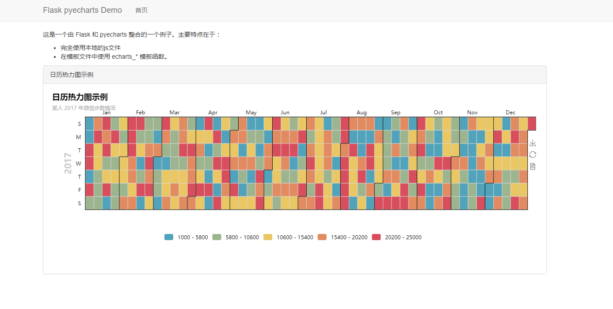

# Flask_python_demo

## 概述

这是一个使用 flask 和 pyecharts (V0.3.0+)整合的一个示例项目，主要特点：

- 整合 Flask 应用默认的模板引擎
- 完全使用本地的 js/css 等静态文件
- 模板文件可以使用模板文件

## 使用

1 安装依赖库

```shell
pip install requirements.txt
```


2 目录说明
analysis: 数据分析脚本目录，从mongodb查询数据进行统计分析，结果数据写到Html或图片jpg里，供前端调取
example:  字体格式文件
static:   静态文件：放置项目用到的图片，js文件等
templates: 集中放置展示页面html,直接用于前端展示
db: 项目用json测试数据

3 进入目录，运行服务启动脚本

```shell
python flask_python_demo.py
```

4 预览，访问浏览器 http://127.0.0.1:10200 即可。

